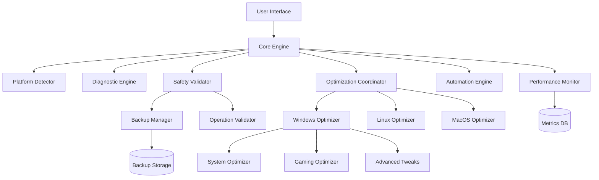

# Design Document: PC Performance Optimizer

## Overview

O PC Performance Optimizer é um sistema multiplataforma de otimização de desempenho construído com arquitetura modular que separa lógica de diagnóstico, otimização e interface. O sistema opera através de um motor central que coordena módulos específicos de plataforma, garantindo segurança através de validação pré-execução e mecanismos de rollback.

A arquitetura prioriza:
- **Segurança**: Validação antes de qualquer modificação, criação automática de restore points
- **Modularidade**: Componentes independentes para cada plataforma e tipo de otimização
- **Extensibilidade**: Novos módulos de otimização podem ser adicionados sem afetar o core
- **Performance**: Operações assíncronas e diagnóstico rápido (< 60s)

## Architecture

### High-Level Architecture



### Component Layers

1. **Presentation Layer**: User Interface (Electron-based para multiplataforma)
2. **Application Layer**: Core Engine, Coordination Logic
3. **Domain Layer**: Platform-specific Optimizers, Diagnostic Engine, Safety Validator
4. **Infrastructure Layer**: System APIs, File System, Registry, Process Management

### Design Patterns

- **Strategy Pattern**: Para módulos de otimização específicos por plataforma
- **Command Pattern**: Para operações reversíveis com undo/redo
- **Observer Pattern**: Para monitoramento em tempo real de métricas
- **Factory Pattern**: Para criação de otimizadores baseado na plataforma detectada
- **Chain of Responsibility**: Para validação de segurança em múltiplos níveis

## Components and Interfaces

### Core Engine

Coordenador central que orquestra todas as operações do sistema.

```typescript
interface CoreEngine {
  // Inicialização e configuração
  initialize(): Promise<void>
  detectPlatform(): Platform
  loadConfiguration(): Configuration
  
  // Operações principais
  runDiagnostic(): Promise<DiagnosticReport>
  executeOptimization(options: OptimizationOptions): Promise<OptimizationResult>
  rollbackOptimization(operationId: string): Promise<void>
  
  // Monitoramento
  startMonitoring(): void
  stopMonitoring(): void
  getMetrics(): PerformanceMetrics
}

enum Platform {
  Windows,
  Linux,
  MacOS
}

interface Configuration {
  platform: Platform
  enabledModules: string[]
  safetyLevel: SafetyLevel
  licenseType: LicenseType
}

enum SafetyLevel {
  Minimal,    // Apenas otimizações 100% seguras
  Standard,   // Otimizações seguras + algumas reversíveis
  Advanced    // Todas otimizações incluindo tweaks avançados
}

enum LicenseType {
  Free,
  Pro,
  Enterprise
}
```

### Diagnostic Engine

Analisa o sistema e identifica gargalos de desempenho.

```typescript
interface DiagnosticEngine {
  // Análise de componentes
  analyzeCPU(): Promise<CPUAnalysis>
  analyzeRAM(): Promise<RAMAnalysis>
  analyzeDisk(): Promise<DiskAnalysis>
  analyzeGPU(): Promise<GPUAnalysis>
  analyzeNetwork(): Promise<NetworkAnalysis>
  
  // Relatório completo
  generateReport(): Promise<DiagnosticReport>
}

interface DiagnosticReport {
  timestamp: Date
  systemInfo: SystemInfo
  bottlenecks: Bottleneck[]
  healthScore: number  // 0-100
  recommendations: Recommendation[]
}

interface Bottleneck {
  component: ComponentType
  severity: Severity
  description: string
  impact: string
  suggestedFix: string
}

enum ComponentType {
  CPU,
  RAM,
  Disk,
  GPU,
  Network
}

enum Severity {
  Critical,  // Impacto severo no desempenho
  High,      // Impacto significativo
  Medium,    // Impacto moderado
  Low        // Impacto mínimo
}

interface SystemInfo {
  os: string
  osVersion: string
  cpu: CPUInfo
  ram: RAMInfo
  disks: DiskInfo[]
  gpu: GPUInfo
}
```

### Optimization Module

Interface base para todos os módulos de otimização.

```typescript
interface OptimizationModule {
  name: string
  platform: Platform
  requiredLicense: LicenseType
  
  // Capacidades
  canOptimize(): boolean
  getAvailableOptimizations(): Optimization[]
  
  // Execução
  applyOptimization(optimization: Optimization): Promise<OperationResult>
  validateOptimization(optimization: Optimization): ValidationResult
}

interface Optimization {
  id: string
  name: string
  description: string
  category: OptimizationCategory
  impactLevel: ImpactLevel
  reversible: boolean
  requiresRestart: boolean
  operations: Operation[]
}

enum OptimizationCategory {
  System,
  Gaming,
  Network,
  Startup,
  Memory,
  Disk,
  Registry,
  Drivers
}

enum ImpactLevel {
  Low,      // Melhoria < 5%
  Medium,   // Melhoria 5-15%
  High,     // Melhoria 15-30%
  Critical  // Melhoria > 30%
}

interface Operation {
  type: OperationType
  target: string
  parameters: Record<string, any>
  validation: ValidationRule[]
}

enum OperationType {
  ServiceDisable,
  ServiceEnable,
  RegistryModify,
  PowerPlanChange,
  StartupDisable,
  ProcessPriority,
  NetworkTweak,
  FileDelete,
  ConfigModify
}
```

### Windows Optimizer

Implementação específica para Windows.

```typescript
interface WindowsOptimizer extends OptimizationModule {
  // Otimizações de sistema
  disableUnnecessaryServices(services: string[]): Promise<OperationResult>
  optimizeStartup(): Promise<OperationResult>
  configurePowerPlan(plan: PowerPlan): Promise<OperationResult>
  adjustVisualEffects(settings: VisualEffectSettings): Promise<OperationResult>
  
  // Registry tweaks
  applyRegistryTweaks(tweaks: RegistryTweak[]): Promise<OperationResult>
  
  // Gaming optimizations
  enableGameMode(): Promise<OperationResult>
  optimizeGPUSettings(settings: GPUSettings): Promise<OperationResult>
  reduceInputLag(): Promise<OperationResult>
  
  // Network
  optimizeTCPIP(): Promise<OperationResult>
  configureDNS(dnsServers: string[]): Promise<OperationResult>
  
  // Cleanup
  cleanTemporaryFiles(): Promise<OperationResult>
  clearSystemCache(): Promise<OperationResult>
}

interface RegistryTweak {
  key: string
  valueName: string
  valueType: RegistryValueType
  value: any
  backup: any  // Valor original para rollback
  safetyRating: number  // 0-10
}

enum RegistryValueType {
  DWORD,
  QWORD,
  String,
  Binary,
  MultiString
}

interface PowerPlan {
  mode: PowerMode
  customSettings?: PowerSettings
}

enum PowerMode {
  MaxPerformance,
  Balanced,
  PowerSaver,
  Custom
}
```

### Safety Validator

Valida segurança das operações antes da execução.

```typescript
interface SafetyValidator {
  // Validação de operações
  validateOperation(operation: Operation): ValidationResult
  validateBatch(operations: Operation[]): ValidationResult
  
  // Checagens de segurança
  isCriticalService(serviceName: string): boolean
  isSafeRegistryKey(key: string): boolean
  isReversible(operation: Operation): boolean
  
  // Backup e restore
  requiresBackup(operation: Operation): boolean
  canRollback(operationId: string): boolean
}

interface ValidationResult {
  valid: boolean
  errors: ValidationError[]
  warnings: ValidationWarning[]
  safetyScore: number  // 0-100
}

interface ValidationError {
  code: ErrorCode
  message: string
  operation: Operation
  severity: Severity
}

interface ValidationWarning {
  code: WarningCode
  message: string
  recommendation: string
}
```

### Backup Manager

Gerencia criação e restauração de backups.

```typescript
interface BackupManager {
  // Criação de backups
  createRestorePoint(description: string): Promise<RestorePoint>
  backupRegistry(keys: string[]): Promise<RegistryBackup>
  backupConfiguration(config: SystemConfig): Promise<ConfigBackup>
  
  // Restauração
  restoreFromPoint(pointId: string): Promise<void>
  restoreRegistry(backupId: string): Promise<void>
  restoreConfiguration(backupId: string): Promise<void>
  
  // Gerenciamento
  listRestorePoints(): RestorePoint[]
  deleteRestorePoint(pointId: string): Promise<void>
}

interface RestorePoint {
  id: string
  timestamp: Date
  description: string
  operations: Operation[]
  backups: Backup[]
}

interface Backup {
  id: string
  type: BackupType
  data: any
  checksum: string
}

enum BackupType {
  Registry,
  Configuration,
  Service,
  File
}
```

### Automation Engine

Gera e executa scripts de automação.

```typescript
interface AutomationEngine {
  // Geração de scripts
  generateScript(optimizations: Optimization[], format: ScriptFormat): string
  generateScheduledTask(script: string, schedule: Schedule): ScheduledTask
  
  // Execução
  executeScript(script: string): Promise<ExecutionResult>
  executeScheduledTask(taskId: string): Promise<ExecutionResult>
  
  // Gerenciamento
  listScheduledTasks(): ScheduledTask[]
  cancelTask(taskId: string): Promise<void>
}

enum ScriptFormat {
  PowerShell,
  Batch,
  BashScript,
  ShellScript
}

interface Schedule {
  type: ScheduleType
  frequency?: string  // cron-like format
  triggers?: TriggerEvent[]
}

enum ScheduleType {
  Once,
  Daily,
  Weekly,
  OnStartup,
  OnIdle,
  OnEvent
}

enum TriggerEvent {
  SystemBoot,
  UserLogin,
  HighCPU,
  LowMemory,
  GameDetected
}
```

### Performance Monitor

Monitora métricas do sistema em tempo real.

```typescript
interface PerformanceMonitor {
  // Coleta de métricas
  collectCPUMetrics(): CPUMetrics
  collectRAMMetrics(): RAMMetrics
  collectGPUMetrics(): GPUMetrics
  collectDiskMetrics(): DiskMetrics
  collectNetworkMetrics(): NetworkMetrics
  
  // FPS overlay para jogos
  startFPSMonitoring(): void
  stopFPSMonitoring(): void
  getCurrentFPS(): number
  
  // Histórico
  getMetricsHistory(duration: number): MetricsHistory
  
  // Alertas
  setThreshold(metric: MetricType, threshold: number): void
  onThresholdExceeded(callback: (alert: Alert) => void): void
}

interface CPUMetrics {
  overall: number  // 0-100%
  perCore: number[]
  temperature: number
  frequency: number
  processes: ProcessMetric[]
}

interface RAMMetrics {
  total: number
  used: number
  available: number
  cached: number
  processes: ProcessMetric[]
}

interface GPUMetrics {
  utilization: number
  memory: number
  temperature: number
  fanSpeed: number
  powerDraw: number
}

interface ProcessMetric {
  name: string
  pid: number
  cpu: number
  memory: number
  priority: ProcessPriority
}
```

### User Interface

Interface gráfica simplificada.

```typescript
interface UserInterface {
  // Navegação principal
  showDashboard(): void
  showDiagnostic(): void
  showOptimizations(): void
  showMonitoring(): void
  showSettings(): void
  
  // Ação principal
  onOptimizeClick(callback: () => void): void
  
  // Feedback visual
  showProgress(operation: string, progress: number): void
  showResult(result: OptimizationResult): void
  showError(error: Error): void
  
  // Modo avançado
  toggleAdvancedMode(): void
  showOptimizationDetails(optimization: Optimization): void
}

interface OptimizationResult {
  success: boolean
  appliedOptimizations: Optimization[]
  failedOptimizations: Optimization[]
  beforeMetrics: PerformanceMetrics
  afterMetrics: PerformanceMetrics
  improvementPercentage: number
}
```

## Data Models

### System Configuration

```typescript
interface SystemConfig {
  version: string
  platform: Platform
  license: License
  preferences: UserPreferences
  modules: ModuleConfig[]
}

interface License {
  type: LicenseType
  key: string
  expirationDate?: Date
  features: string[]
}

interface UserPreferences {
  safetyLevel: SafetyLevel
  autoOptimizeOnStartup: boolean
  createRestorePoints: boolean
  showAdvancedOptions: boolean
  enableMonitoring: boolean
  enableFPSOverlay: boolean
}

interface ModuleConfig {
  name: string
  enabled: boolean
  settings: Record<string, any>
}
```

### Operation Log

```typescript
interface OperationLog {
  id: string
  timestamp: Date
  type: OperationType
  operation: Operation
  result: OperationResult
  rollbackAvailable: boolean
}

interface OperationResult {
  success: boolean
  message: string
  error?: Error
  duration: number
  changes: Change[]
}

interface Change {
  target: string
  before: any
  after: any
  reversible: boolean
}
```

### Performance Baselines

```typescript
interface PerformanceBaseline {
  platform: Platform
  hardwareClass: HardwareClass
  metrics: BaselineMetrics
}

enum HardwareClass {
  LowEnd,
  MidRange,
  HighEnd,
  Enthusiast
}

interface BaselineMetrics {
  cpu: CPUBaseline
  ram: RAMBaseline
  disk: DiskBaseline
  gpu: GPUBaseline
  fps: FPSBaseline
}

interface CPUBaseline {
  idleUsage: number
  normalUsage: number
  gamingUsage: number
}

interface FPSBaseline {
  lowSettings: number
  mediumSettings: number
  highSettings: number
  ultraSettings: number
}
```

## Correctness Properties

*Uma propriedade é uma característica ou comportamento que deve ser verdadeiro em todas as execuções válidas de um sistema - essencialmente, uma declaração formal sobre o que o sistema deve fazer. Propriedades servem como ponte entre especificações legíveis por humanos e garantias de correção verificáveis por máquina.*

